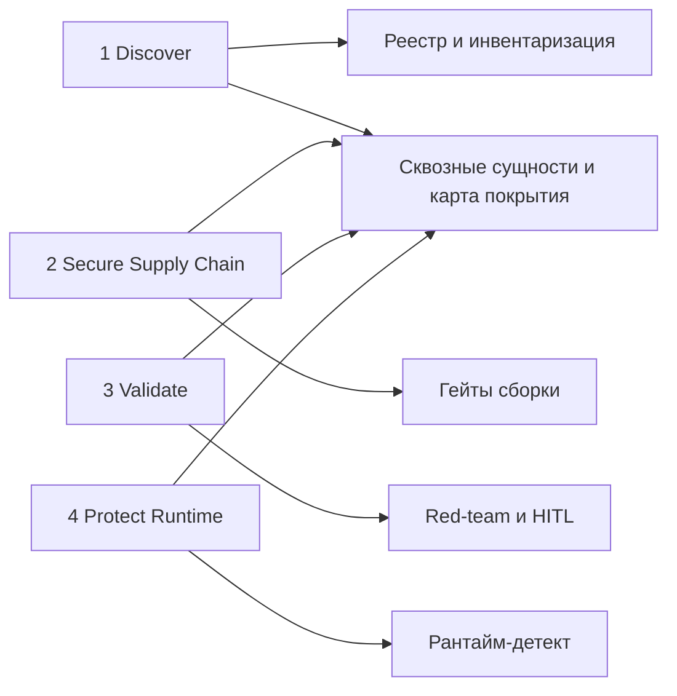
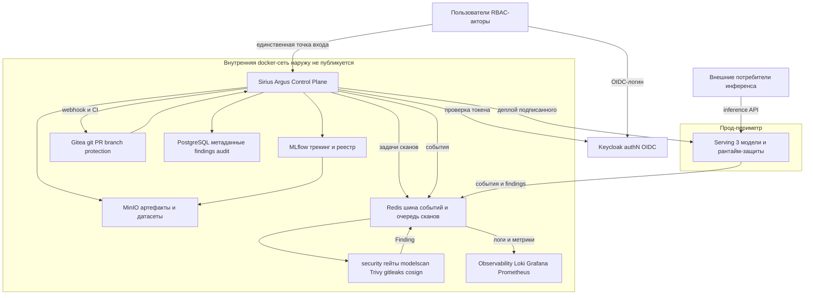
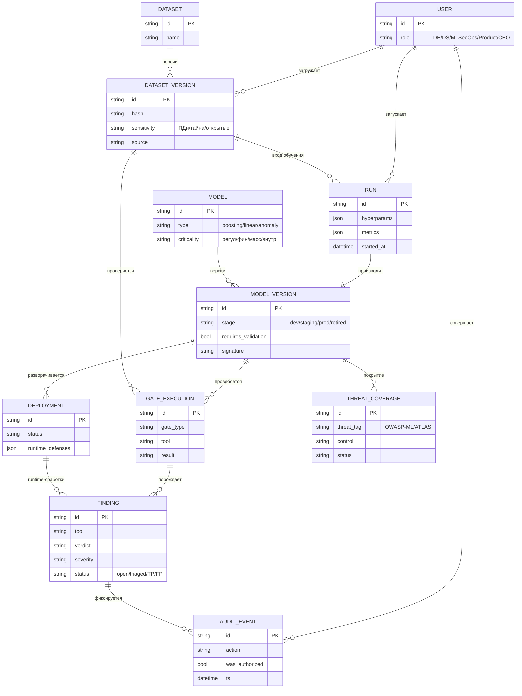
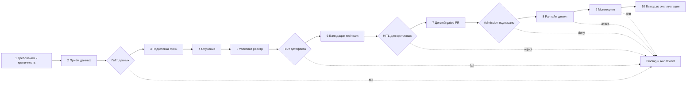
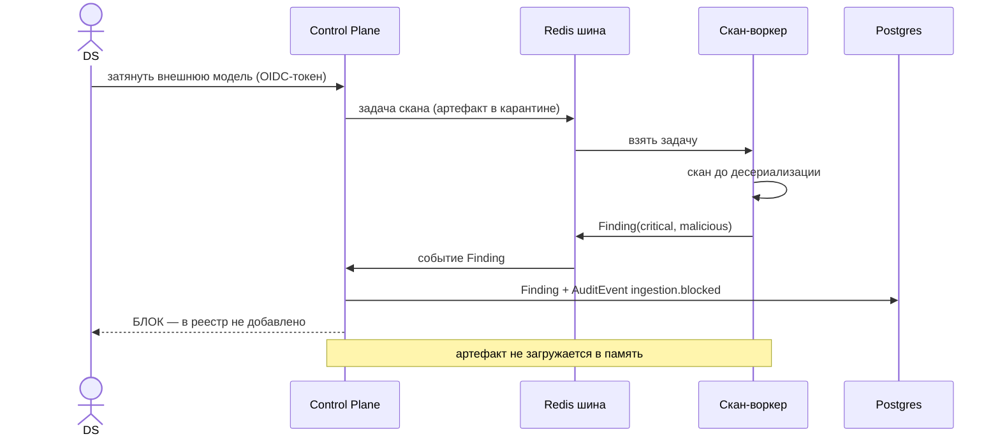
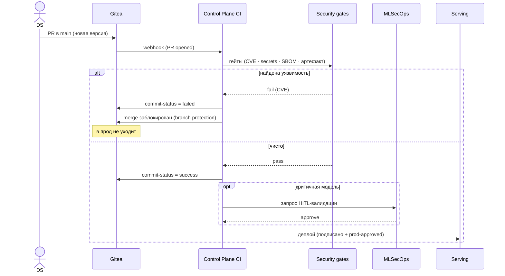
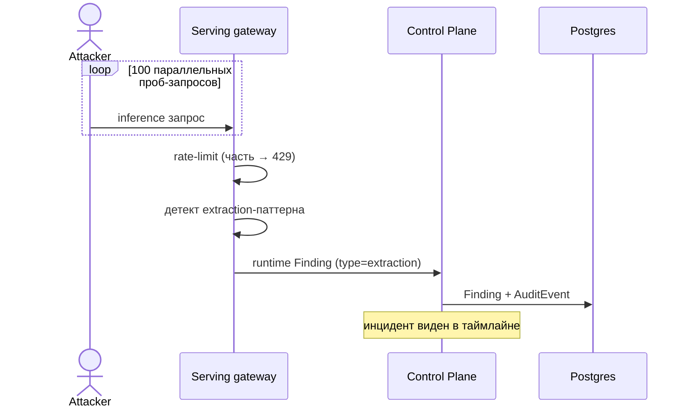
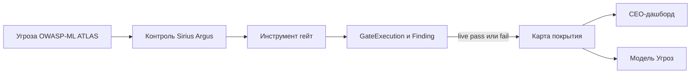

# Sirius Argus — Архитектура безопасной MLOps-системы

> Статус: рабочий драфт архитектуры. Документ описывает **единое связное решение**: платформу, которая делает безопасность встроенной автоматической фичей ML-пайплайна, а не патчем поверх. Роли в тексте — это **системные акторы RBAC**, а не исполнители.

---

## 1. Контекст и цель

Бизнес зарабатывает на ML ровно до первого инцидента. MLOps делает систему надёжной и воспроизводимой, но почти ничего не знает о безопасности. **Sirius Argus** добавляет недостающий слой MLSecOps: видит весь пайплайн, понимает, что в проде, и управляет системой, а не латает дыры.

**Цель:** собрать из готовых блоков безопасную MLOps-систему, склеить её практиками MLSecOps и доказать на работающем MVP, что ключевые боли (типичные для ML-систем) закрыты — с полной видимостью статуса защищённости.

**Нефункциональные требования (договорённости):**
- Всё поднимается на ноутбуке одной командой `docker compose up`.
- Демо-сценарии запускаются легко (в пределе — одной командой-конвейером).
- Никаких реальных RCE-закладок в коде.
- Покрытие всего жизненного цикла ML-решения — от требований до вывода из эксплуатации.

---

## 2. Принципы проектирования

1. **Zero-trust.** Каждое действие проверяется на право и логируется. Доступы — по наименьшим привилегиям, не «всем всё».
2. **Security-as-default.** Безопасность — не отдельная кнопка, а свойство пайплайна: проверки запускаются автоматически на естественных переходах (приём данных, обучение, промоушен, инференс).
3. **Единая точка входа в прод.** В прод нельзя попасть иначе как через контролируемый gated-флоу. Обходных путей (force-push в master, «собрал докер мимо») нет.
4. **Integration-first.** Ценность — в связности: хранилище ↔ реестр ↔ сканеры ↔ findings ↔ аудит ↔ UI. Не набор разрозненных тулз, а один организм.
5. **Полная видимость.** Для любого актива видно: какие проверки прошли, какие сработки есть, какие угрозы покрыты и каков текущий статус защищённости.
6. **Покрытие всего ЖЦ.** Контроли расставлены на каждом этапе жизненного цикла, а не только «на входе».
7. **Честные границы.** Остаточные риски (напр. ShadowLogic-класс бэкдоров) фиксируются явно, а не прячутся.

---

## 3. Эталонные источники и как они легли в основу

| Источник | Что взято на вооружение |
|---|---|
| **Обобщённый разбор инцидентов ML-систем** | Таксономия по **активам (1–10)** как спинной хребет Модели Угроз; CIA-модель; adversary model; конкретный набор практик и инструментов (реестр, классификация критичности, скан артефактов, safetensors, подпись, security gates, rate-limit, extraction-анализ, drift). |
| **HiddenLayer (платформа)** | Рамка из **4 столпов**: Discovery → Supply Chain Security → Attack Simulation → Runtime Security. Прямой маппинг на наши способности. |
| **HiddenLayer (research, ShadowLogic)** | Инсайт: бэкдор может жить в «безопасных» форматах (ONNX/safetensors) на уровне графа → `safetensors` не серебряная пуля; нужен этап валидации/red-team и явный учёт остаточного риска. |
| **Фреймворки** | OWASP ML Security Top 10, MITRE ATLAS, NIST AI RMF, Google SAIF, ENISA — используются как чек-лист покрытия и язык описания угроз в МУ (см. §11). |

---

## 4. Модель безопасности: 4 столпа

Возможности Sirius Argus сгруппированы в 4 столпа (по HiddenLayer), каждый закрывает свой класс угроз:

| Столп | Что делает в Sirius Argus | Тип защиты |
|---|---|---|
| **Discover** (инвентаризация) | Реестр моделей/датасетов с версиями, гиперпараметрами, lineage, критичностью и чувствительностью; «нет тени» — всё, что в системе, видно. | непрерывный учёт |
| **Secure supply chain** (целостность на сборке) | Скан кода (SAST), скан артефактов (pickle/keras), скан зависимостей, SBOM/MLBOM, подпись, политика форматов (convert-or-reject), gitleaks, policy-gates на PR. | build-time |
| **Validate** (симуляция атак / red-team) | Adversarial-тестирование (ART), risk assessment, HITL-валидация критичных моделей перед релизом. | pre-prod |
| **Protect runtime** (firewall + detect & respond) | AuthN, rate-limit, детект extraction/adversarial/drift на инференсе → сработки в общий таймлайн. | runtime |

Связка столпов через **сквозные сущности** `Finding` (сработки) и `AuditEvent` (история) и через **Карту покрытия** (§9).

> **Подпись ≠ безопасность.** Столп Secure (скан + подпись) доказывает подлинность и отсутствие известного зловреда, но не безопасность поведения модели — за это отвечает столп Validate (red-team / HITL). Подпись всегда идёт поверх скана и валидации, не вместо них. Детали подписи и провенанса — [ADR-0006](adr/0006-model-signing-provenance.md).

---

## 5. Логическая архитектура

### 5.1 Компоненты и ответственность

| Компонент | Роль | Почему так |
|---|---|---|
| **Control Plane** (FastAPI) | Единственная точка входа для людей; AuthZ, реестр, оркестрация гейтов, CI-обработчик вебхуков, findings, аудит, UI, карта покрытия. | Кастомный слой даёт контроль над RBAC/видимостью, которого нет в готовых тулзах. |
| **MLflow** (обёрнут) | Backend трекинга/реестра: версии, гиперпараметры, артефакты. **Порт наружу не публикуется** — доступ только через Control Plane. | Версии/гиперпараметры/lineage «даром»; недоступность напрямую = живая демонстрация zero-trust и единой точки входа («у MLflow нет RBAC — мы его и не выставляем»). |
| **MinIO** | S3-хранилище артефактов моделей и датасетов; версионирование по контент-хешу. | Реалистичный объектный стор, +1 контейнер. |
| **Gitea** | Локальный git: PR, branch protection, вебхуки. **Единая точка входа в прод.** | Полностью локально, без внешних зависимостей; куратор предпочитает self-hosted. |
| **Postgres** | Метаданные платформы: пользователи/роли, реестр-надстройка, findings, audit, coverage, deployments. | Реляционная целостность связей между активами и сработками. |
| **security/** (библиотека гейтов) | Общий код проверок, вызывается **и CI, и Control Plane** (одна логика в двух местах). | Build-time и интерактивные проверки не расходятся. |
| **Serving** | Сервинг 3 моделей за единым gateway + runtime-защиты. | Прод-периметр, где живут runtime-атаки и их детект. |
| **Keycloak** (OIDC) | AuthN, пользователи, роли/группы, токены; realm-as-code. Object-authz остаётся в Control Plane. | Не катаем свой auth ([ADR-0007](adr/0007-keycloak-authn.md)); узнаваем судьями; есть в `main`. |
| **Redis** (брокер) | Шина событий + async-очередь сканов; заодно бэкенд rate-limit. | Развязка вместо API-меша; долгие сканы вне HTTP ([ADR-0008](adr/0008-message-broker.md)). |
| **Observability** (Loki/Grafana/Prometheus) | Отдельный лог-стор + метрики + дашборды; питается событиями с шины. | Аудит ≠ observability ([ADR-0009](adr/0009-observability-logstore.md)); «каждое действие сохранено». |

**Взаимодействие и логирование.** Прямые чтения (control-plane → MLflow/MinIO/Gitea) — синхронный HTTP; долгие сканы и все значимые события — через **шину Redis** ([ADR-0008](adr/0008-message-broker.md)), а не API-меш. Логи разведены: **аудит** (security, tamper-evident) — Postgres + hash-chain; **операционные логи и метрики** — отдельный лог-стор (Loki/Grafana/Prometheus, [ADR-0009](adr/0009-observability-logstore.md)). Каждое действие → событие → и в аудит, и в лог-стор.

---

## 6. Доменная модель

Все сущности связаны; сработки и аудит — сквозные. Идентичность и роли (`User/Role`) — из Keycloak (OIDC); object-authz — в control-plane.

| Сущность | Ключевые поля | Связи |
|---|---|---|
| **User / Role** | роль, права; zero-trust | автор всех действий |
| **Dataset / DatasetVersion** | источник, **sensitivity** (ПДн/банк.тайна/открытые), хеш, lineage | ← Run |
| **Model / ModelVersion** | тип, **criticality** (регуляторная/финансовая/массовая/внутренняя), security profile, `requires_validation`, стадия (dev→staging→prod→retired) | ← Run, → Deployment |
| **Run** | гиперпараметры, метрики, lineage (датасет→код→модель), автор, время | Dataset→Model |
| **GateExecution / Scan** | тип гейта, инструмент, что/сколько сканировали, итог | → Finding |
| **Finding (сработка)** | инструмент, вердикт, severity, **статус (open/triaged/TP/FP)**, привязка к активу (модель/датасет/PR/endpoint) | сквозная |
| **AuditEvent** | актор, действие, объект, «имел ли право», время; **append-only** | сквозная |
| **ThreatCoverage** | актив → контроль → покрытая угроза → live-статус | питает Карту покрытия |
| **Deployment / Endpoint** | модель@версия, runtime-защиты, статус, доступы | ← ModelVersion |

**Принцип «одна тулза ок, другая плохо»:** один `GateExecution` может породить несколько `Finding` от разных инструментов с разными вердиктами — оба видны, оба триажатся (TP/FP). Если атака была — узнаём; если фолз — тоже узнаём и закрываем.

---

## 7. Жизненный цикл ML и контроли на каждом этапе

| Этап ЖЦ | Активы (категории) | Ключевые угрозы | Контроли Sirius Argus | Где в системе |
|---|---|---|---|---|
| 1. Требования и дизайн | 9 Governance | нет threat-модели, неучтённая критичность | классификация критичности модели, threat-modeling per model | Реестр (поля), МУ |
| 2. Приём данных | 5 Данные, 7 Supply | poisoning, label-flipping, недоверенный источник, ПДн | классификация sensitivity, lineage, trusted sources, карантин UGC, проверки качества, бэкдор-детект | Control Plane + гейты |
| 3. Подготовка/фичи | 5 Данные | training-serving skew, ПДн в логах | контракты фичей, consistency-тесты, маскирование ПДн | гейты + serving |
| 4. Обучение | 2 Код, 3 IAM | секреты в коде, нерепродьюсибилити | gitleaks, фикс зависимостей, трекинг гиперпараметров/lineage | Gitea CI + MLflow |
| 5. Упаковка/реестр | 6 Модели, 7 Supply | вредоносный pickle (RCE), typosquatting, отсутствие подписи | скан артефактов (picklescan/modelscan/fickling), **автоконвертация pickle→safetensors или запрет небезопасного формата**, SBOM/MLBOM, подпись, scan зависимостей | гейты + Реестр |
| 6. Валидация / red-team | 6 Модели, 8 Adversarial | необнаруженный бэкдор (ShadowLogic), хрупкость к adversarial | ART-тесты, risk assessment, **HITL-валидация** критичных | Control Plane (HITL) |
| 7. Деплой | 7 Supply, 9 Governance | обход в прод, неподписанный артефакт | **gated PR**, branch protection, «в прод только подписанное и прошедшее гейты» | Gitea + Control Plane |
| 8. Эксплуатация/рантайм | 4 Сеть, 8 Adversarial | extraction, evasion, DoS, неавторизованный доступ | authN, rate-limit, extraction-detect, adversarial/FGSM-detect, output reduction | Serving |
| 9. Мониторинг/детект | 10 Мониторинг | concept/data drift, тихая деградация | drift-мониторинг, переоценка метрик, инцидент→Finding, таймлайн | Serving + Control Plane |
| 10. Вывод из эксплуатации | 3 IAM, 9 Governance | неотозванные доступы, «никто не может перевывести» | снятие endpoint, отзыв доступов, архив с lineage, аудит | Control Plane |

---

## 8. Ключевые потоки

> Все акторы аутентифицированы через Keycloak (OIDC); сканы и сработки идут асинхронно через шину Redis ([ADR-0008](adr/0008-message-broker.md)) — явно показано в потоке A, в C/D подразумевается.

**A. Приём внешней модели (showpiece).** Актор тянет модель (HF/локально) → Control Plane запускает скан артефакта → вредоносный pickle → **БЛОК** + `Finding(critical)` + `AuditEvent`; чистая модель регистрируется. Артефакт никогда не десериализуется до прохождения скана.

**B. Обучение.** DS обучает → `Run` (гиперпараметры, метрики, lineage) в MLflow, артефакт в MinIO → авто-генерится Model Card / security profile → артефакт **подписывается с провенанс-аттестацией** (in-toto/cosign), и дальше принимается только подписанным ([ADR-0006](adr/0006-model-signing-provenance.md)).

**C. Промоушен через единую точку входа.** PR в `main` → вебхук Gitea → Control Plane (как CI) гоняет гейты `security/` → `commit-status` обратно в PR + синк `Finding` к версии/стадии. Уязвимая зависимость → красный чек → **merge заблокирован**. Чистый PR + (для критичной модели) **HITL-аппрув MLSecOps** → промоушен в прод, артефакт подписан. Обходных путей нет.

**D. Runtime-инцидент.** Бёрст extraction-запросов на endpoint → детект паттерна + rate-limit → `Finding` + запись в таймлайн. Аналогично — adversarial/FGSM-вход и drift.

**E. Вывод из эксплуатации.** Модель → retired: endpoint снят, доступы отозваны, lineage заархивирован, всё в `AuditEvent`.

Эти потоки в демо сшиваются в **один конвейер** (датасет→проверки→обучение→проверки→HITL→gated-деплой→рантайм-атака→decommission).

---

## 9. Карта покрытия — мост между МУ и платформой

Главный артефакт видимости. Для каждого актива и для системы в целом показывает: **угроза → каким контролем закрыта → каким инструментом → текущий live-статус** (из реальных `Finding`/`GateExecution`). Это и есть «статус защищённости», который запрашивают лиды, и прямая проекция Модели Угроз на работающую систему. CEO-дашборд («✅ всё супер») — это агрегированный верхний срез этой же карты поверх реальных данных.

---

## 10. Безопасность самой платформы (zero-trust)

**AuthN — Keycloak (OIDC)** ([ADR-0007](adr/0007-keycloak-authn.md)): идентичность, пользователи, роли/группы, токены, сервисные identity. **Объектная авторизация** (можно ли актору трогать ИМЕННО этот объект) — в Control Plane; Keycloak даёт роль, а не право на объект.

**Матрица RBAC (наименьшие привилегии):**

| Действие \ Роль | DE | DS | MLSecOps | Product | CEO |
|---|:--:|:--:|:--:|:--:|:--:|
| Приём/версии датасетов, классификация sensitivity | ✅ | — | ✅ | — | — |
| Обучение/регистрация модели | — | ✅ | — | — | — |
| Запрос промоушена | — | ✅ | — | — | — |
| Конфиг гейтов/политик, триаж findings | — | — | ✅ | — | — |
| HITL-валидация / аппрув критичной модели | — | — | ✅ | — | — |
| Управление runtime-защитами, decommission | — | — | ✅ | — | — |
| Бизнес-критичность, чтение реестра | — | — | ✅ | ✅ | — |
| Исполнительный дашборд (read-only) | — | — | ✅ | ✅ | ✅ |

Отдельный **сервисный (CI) актор** — неинтерактивный, со scoped-токеном: запускает гейты и пишет findings, не имеет прав человека.

**Прочее:** MLflow/MinIO/Gitea/Postgres — во внутренней docker-сети, наружу торчит только Control Plane (и прод-gateway сервинга). Секреты — через env/секрет-стор, gitleaks на PR. Каждое действие проверяется на право и попадает в append-only аудит.

---

## 11. Соответствие фреймворкам (стартовый маппинг)

| OWASP ML Top 10 | Контроль Sirius Argus |
|---|---|
| ML01 Input Manipulation (evasion) | runtime adversarial/FGSM-detect, input-валидация, ART на валидации |
| ML02 Data Poisoning | trusted sources, карантин UGC, бэкдор-детект, проверки качества, версии+lineage |
| ML03 Model Inversion | output reduction (категории вместо вероятностей) *(частично; differential privacy — остаточный)* |
| ML04 Membership Inference | output reduction/randomization, контракты API *(частично)* |
| ML05 Model Theft (extraction) | rate-limit, extraction-detect, контроль гранулярности output, watermarking *(стретч)* |
| ML06 AI Supply Chain | скан артефактов, скан зависимостей, SBOM/MLBOM, internal mirror/allow-list, подпись, security gates |
| ML07 Transfer Learning Attack | скан внешних/базовых моделей; ShadowLogic — остаточный риск (см. §12) |
| ML08 Model Skewing | drift-мониторинг, training-serving consistency, переоценка метрик |
| ML09 Output Integrity | подпись/целостность ответов, контракты output |
| ML10 Model Poisoning (weights/backdoor) | скан артефактов, подпись, валидация; ShadowLogic — остаточный риск |

**MITRE ATLAS** используется как язык тактик (Recon → Resource Dev → Initial Access → ML Model Access → Execution → Persistence → Exfiltration → Impact) для описания цепочек атак в МУ. **NIST AI RMF** (Govern/Map/Measure/Manage) — как рамка процессов и приоритизации.

---

## 12. Границы и остаточные риски (осознанно)

- **ShadowLogic-класс бэкдоров** (граф-уровень в ONNX/safetensors) наши сканеры pickle не ловят — частично адресуется этапом валидации/red-team; фиксируется как остаточный риск.
- Без Kubernetes/Seldon/KServe — сервинг на FastAPI (достаточно для ноутбука).
- AuthN — Keycloak (OIDC, [ADR-0007](adr/0007-keycloak-authn.md)); объектная авторизация — в Control Plane. Keycloak — новая поверхность атаки и **SPOF для authN** (см. риск-реестр); митигируем тем, что он во внутр. сети, realm-as-code, и не выставляется наружу напрямую.
- Брокер (Redis) — инфра-зависимость: события можно инъектить/подменять → ACL топиков + критичные события дублируются в tamper-evident аудит.
- Без распределённых CI-раннеров — CI = Control Plane по вебхуку Gitea.
- Генеративные/агентские модели — вне фокуса (бриф: упор на не-генеративные).
- Сертифицированная adversarial-робастность — только базовый детект.
- DVC опционально — датасеты версионируются по контент-хешу в MinIO.

Приоритизация: сначала единая точка входа + supply-chain-гейты + реестр/видимость (ядро), затем runtime-защиты, затем полнота practice-набора.

---

## 13. Технологический стек

| Слой | Технология |
|---|---|
| Control Plane / UI | Python, FastAPI, Jinja2, HTMX, Tailwind (CDN) |
| Трекинг/реестр-backend | MLflow (во внутренней сети) |
| Объектное хранилище | MinIO (S3) |
| Git + CI-вход | Gitea (branch protection, webhooks) |
| Метаданные | PostgreSQL |
| AuthN / идентичность | Keycloak (OIDC, realm-as-code) |
| Гейты безопасности | picklescan, modelscan, fickling, pip-audit, Trivy, Syft, gitleaks, cosign/sigstore, policy-as-code |
| ML / валидация | scikit-learn, XGBoost, ART; deep — только pre-trained CPU-only (без обучения в демо) |
| Брокер / шина событий | Redis Streams (очередь сканов + события, бэкенд rate-limit) |
| Observability / лог-стор | Loki, Grafana, Prometheus |
| Развёртывание | Docker Compose, профили `core` / `full` (full добавляет брокер + observability) |
