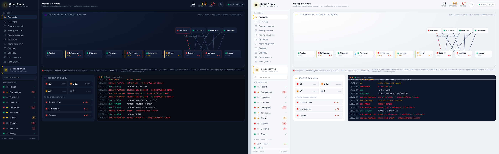
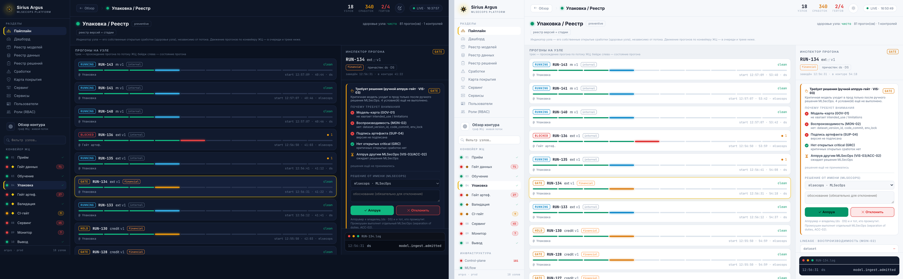

# Дизайн: экран «Пайплайн» — интерактивная карта (`/map`)

> Build-ready спека к [ADR-0011](../adr/0011-interactive-pipeline-map.md). Гибрид «пайплайн + инфра», bespoke SVG/HTML, live-перекраска без мигания, drill в инциденты. Реализует control-plane (стек: FastAPI + Tailwind/HTMX, без сборки фронта).

## Как это выглядит

Обзор контура (тёмная │ светлая тема):



Инспектор прогона с панелью ручного аппрув-гейта — доказательный чеклист и кнопки Аппрув/Отклонить:



## 1. Маршрут и навигация
- `GET /map` → `ui.map_page(...)`. Новый пункт в `_NAV`: `("/map", "Пайплайн", "map")` (не путать с «Картой покрытия» — та табличная CEO-вью; эта — пространственная).

## 2. Узлы (`id` → подпись → ряд)

**Пайплайн (верхний ряд, слева→направо; гейты помечены ◇):**

| id | подпись | тип |
|---|---|---|
| `intake` | Приём данных | стадия |
| `gate-data` | Гейт данных ◇ | гейт |
| `train` | Обучение | стадия |
| `package` | Упаковка / Реестр | стадия |
| `gate-artifact` | Гейт артефакта ◇ | гейт |
| `validate` | Валидация / ручной аппрув-гейт ◇ | стадия+гейт |
| `gate-ci` | CI-гейт ◇ | гейт |
| `serving` | Сервинг | стадия |
| `monitor` | Мониторинг | стадия |
| `decommission` | Вывод из эксплуатации | стадия |

**Инфра (нижняя полоса):** `control-plane` · `mlflow` · `minio` · `gitea` · `postgres` (Аудит) · `keycloak` · `vault` · `bus` (шина/observability).

## 3. Состояния узла
- `clean` 🟢 — нет open-findings. Для **превентивных** контролей (ручной аппрув-гейт, output-reduction, сегментация) узел «armed»-зелёный: подтверждается приёмочным тестом, а не сработкой (см. §8).
- `warn` 🟡 — есть open-findings (не critical).
- `alert` 🔴 — critical / была блокировка; пульс-анимация. Бейдж = число open.

CSS-классы: `.map-clean` (emerald border/bg), `.map-warn` (amber), `.map-alert` (red + `@keyframes` пульс, уважает `prefers-reduced-motion`).

## 4. Маппинг `Finding → узел`
Чистая функция `node_of(finding)` по уже существующим полям (`tool`, `verdict`, `asset_type`, `asset_ref`):

| Условие | Узел |
|---|---|
| `tool ∈ {modelaudit, modelscan, picklescan, fickling}`, asset=model | `gate-artifact` |
| verdict ∈ {unsigned, signature-mismatch, artifact-tamper} (SUP-04/05, TOCTOU-01) | `gate-artifact` |
| asset_type=dataset / verdict ∈ {label-anomaly, poisoning, untrusted-source} (DATA-*) | `gate-data` |
| verdict ∈ {cve, secret, sast, ci-supply-chain} на PR (SUP-03, ACC-06, CODE-01, CI-01) | `gate-ci` |
| `tool=sirius-runtime`, asset_ref начинается с `endpoint/` (extraction/ddos/dow/malformed/adversarial) | `serving` |
| verdict=drift (MON-01) | `monitor` |
| verdict=registry-tamper (REG-01) | `mlflow` |
| verdict ∈ {audit-tamper} (MON-04, LOG-02) | `postgres` |
| verdict ∈ {token-misuse, auth-fail} (CRED-01, AUTH-01) | `keycloak` |
| verdict ∈ {access-denied, idor, privesc} (ACC-01, ESC-01) | `control-plane` |
| verdict=event-integrity (EVT-01) | `bus` |
| verdict ∈ {approval-required, promotion-blocked} (VIS-03) | `validate` |
| *fallback* | `control-plane` |

> Реализовать как один dict/список правил в `control-plane/app/` (напр. `mapnodes.py`), чтобы и `/api/map/status`, и drill использовали один источник истины.

## 5. Эндпоинты (3 новых; остальное переиспользуем)

**5.1 `GET /api/map/status`** → JSON для JS-поллера (раз в ~4 с):
```json
{
  "nodes": {
    "gate-artifact": {"label": "Гейт артефакта", "status": "alert", "open": 2, "sev": "critical", "last": "12:03:41"},
    "serving":       {"label": "Сервинг", "status": "warn", "open": 1, "sev": "high", "last": "12:05:10"},
    "intake":        {"label": "Приём данных", "status": "clean", "open": 0, "sev": null, "last": null}
  }
}
```
Считается: сгруппировать `Finding` (status='open') по `node_of()`, взять max severity → status; превентивные узлы без findings → `clean` (armed).

**5.2 `GET /ui/map/node/{id}`** → HTML-фрагмент drill-панели (HTMX):
- шапка узла: подпись + активные контроли тут (из той же таксономии, что страница «Сервинг»/«Карта покрытия»);
- его сработки: переиспользуем `ui.findings_table(...)` с фильтром `node_of(f)==id`;
- последние audit-события узла: `ui.audit_fragment(...)` по событиям, чьи объекты мапятся на узел.

**5.3 `GET /ui/map/incident/{finding_id}`** → «инцидент» (второй уровень):
- сама сработка (вердикт/severity/детали/статус) + тег угрозы/сценария;
- **окно аудит-таймлайна** вокруг `finding.ts` (события ±N) — `ui.audit_fragment(...)`;
- «что система сделала»: блок / Finding / смена статуса (из verdict + соседнего аудита).

## 6. Рендер (bespoke, без мигания)
- Узлы — `<div id="n-<id>" class="map-node ..." onclick="drill('<id>')">подпись <span class="badge"></span></div>`, Tailwind. Раскладка: два CSS-grid ряда (пайплайн / инфра). Поверх — абсолютный `<svg>` со стрелками между центрами (v1: горизонтальные между стадиями; v2: пунктирные вертикальные стадия↔инфра).
- **Live без пересборки DOM** (ключевая причина bespoke):
```js
async function refreshMap(){
  const s = await fetch('/api/map/status').then(r=>r.json());
  for (const [id, n] of Object.entries(s.nodes)) {
    const el = document.getElementById('n-'+id); if(!el) continue;
    el.classList.remove('map-clean','map-warn','map-alert');
    el.classList.add('map-'+n.status);
    el.querySelector('.badge').textContent = n.open || '';
  }
}
setInterval(refreshMap, 4000); refreshMap();
```
- Drill: `function drill(id){ htmx.ajax('GET','/ui/map/node/'+id,'#map-drill'); }`; внутри панели строки сработок ведут на `/ui/map/incident/{id}`.

## 7. Drill-UX
Узел → панель `#map-drill` (сбоку/снизу): контроли + сработки + аудит узла → клик по сработке → «инцидент» (таймлайн). Закрытие — крестик / клик вне. Подсветить активный узел рамкой.

## 8. Превентивные vs детективные (нюанс статуса)
Зелёный узел может быть зелёным потому, что контроль **превентивный** (ручной аппрув-гейт, output-reduction RT-03/04, сегментация RT-06, fail-closed authN) — он не порождает сработок, когда работает. Такие узлы помечаем «armed» (подтверждено приёмочным тестом), а не «нет данных». Детективные контроли краснеют от реальных findings. Это та же логика, что в `coverage_page` (детективные vs превентивные).

## 9. Реюз / новое
- **Реюз:** `Finding`/`AuditEvent`/`Deployment`, `ui.findings_table`, `ui.audit_fragment`, `audit.recent`.
- **Новое:** `mapnodes.node_of()` + правила, агрегирующий запрос статуса, 3 эндпоинта, `ui.map_page()` + `ui.map_node_fragment()` + `ui.map_incident_fragment()`, немного CSS/JS в `_page`/static.

## 10. Скоуп
- **v1 (MVP, под демо):** два ряда узлов + `/api/map/status` поллинг + перекраска + drill в findings/audit. Стрелки — простые горизонтальные между стадиями.
- **v2:** вертикальные коннекторы стадия↔инфра, пульс на alert, incident-level таймлайн, подсветка «последний инцидент», опциональный слой «потоки данных» (артефакт→реестр→сервинг) поверх статуса.

## 11. Открытые вопросы
- Нужен ли отдельный слой «потоки данных» (стрелки движения артефактов) поверх статуса узлов, или достаточно структурных коннекторов — решаем на v2.
- Группировка findings в «инцидент» (несколько сработок одной атаки) — пока инцидент = одна сработка + окно аудита; настоящая корреляция — позже.
