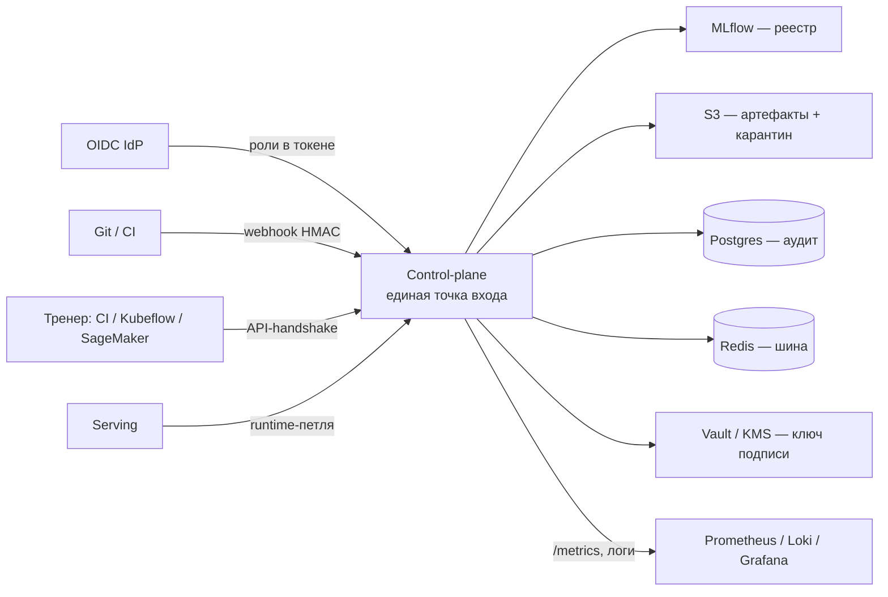
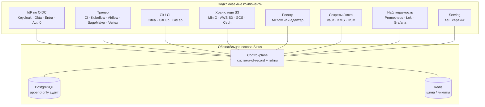

# Интеграция Sirius Argus в контур заказчика

Sirius Argus — контур контроля и видимости вокруг ML-пайплайна, а не замена вашей платформе обучения, реестру или CI. Вы сохраняете свой стек; Sirius встаёт в заранее заданные точки и делает control-plane единственным путём в прод. Тренинг, оркестрация и компьют остаются у вас; гейты, аудит, подпись и governance — у Sirius.

> Контроль технически принудителен (сеть + authZ + fail-closed гейты), а не «договорённость на бумаге». Прямой пуш в реестр или прод в обход control-plane должен быть закрыт.

## Модель интеграции (что с чем)

| Точка интеграции | Система заказчика | Интерфейс | Направление | Обязательно |
|---|---|---|---|---|
| Идентичность (AuthN) | OIDC-провайдер (Keycloak / Okta / Entra ID / …) | OIDC + JWKS; роли в claim `realm_access.roles` | заказчик → Sirius | Да (или `DEV_AUTH` только для демо) |
| Обучение | любой тренер (CI-job, MLflow Project, Kubeflow, Airflow, SageMaker, Vertex) | REST `/api/*` под сервис-аккаунтом (handshake) | тренер → Sirius | Да |
| CI / единая точка входа | Git (Gitea / GitHub / GitLab) | webhook `POST /api/ci/webhook` (HMAC) + commit-status | Git → Sirius → Git | Да (для gated-PR) |
| Реестр моделей | MLflow | обёрнут; запись только через control-plane; write-through тегов fail-soft | Sirius → MLflow | свой или встроенный |
| Хранилище артефактов | S3-совместимое (MinIO / AWS S3 / …) | S3 API; отдельный карантин-бакет | Sirius → S3 | Да |
| Секреты и ключ подписи | Vault / KMS / HSM | AppRole + политика; ключ Ed25519 офлайн | Sirius → Vault | Да в проде (env-fallback для демо) |
| Метаданные + аудит | PostgreSQL | append-only триггер + hash-chain | — | Да |
| Шина событий / rate-limit | Redis | pub/sub + счётчики окна | — | Да |
| Сервинг | ваш serving за рантайм-защитами | петля runtime → control-plane по сервис-токену | serving → Sirius | Да |
| Наблюдаемость | Prometheus / Loki / Grafana | `/metrics` + выгрузка логов с шины | Sirius → стек | Опционально |

## Где подключить своё (вариативность компонентов)

Авторитетный реестр и аудит — это **сам control-plane** (его Postgres-надстройка: версии, стадии, критичность, lineage, append-only аудит). Компоненты вокруг заменяются совместимыми, пока соблюдён контракт интеграции. Обязательное ядро — только control-plane, PostgreSQL и Redis; остальное подключается по стандартным протоколам.

| Компонент | По умолчанию | Можно подключить своё | Контракт, который должен держаться | Вариативность |
|---|---|---|---|---|
| IdP (AuthN) | Keycloak | любой OIDC: Okta, Entra ID, Auth0, Ping, Google | JWT с ролями в claim; для не-Keycloak — маппинг claim → роль | высокая |
| Тренер | CI-job | Kubeflow, Airflow, MLflow Project, SageMaker, Vertex | REST-handshake под сервис-аккаунтом без `promote` | полная |
| Git / CI | Gitea + control-plane-как-CI | GitHub, GitLab, Bitbucket; либо шаг в вашем CI | webhook с HMAC → `/api/ci/webhook`, либо вызов гейта из вашего пайплайна | высокая |
| Хранилище | MinIO | AWS S3, GCS (S3-interop), Ceph, Wasabi | S3 API + отдельный карантин-бакет | высокая |
| **Реестр моделей** | **обёрнутый MLflow** | **ваш MLflow; другой реестр — через адаптер; либо без внешнего реестра** | **control-plane — источник истины; запись write-through и fail-soft** | **через адаптер** |
| Секреты / ключ | Vault (AppRole) | AWS KMS / Secrets Manager, Azure Key Vault, GCP SM, HSM | ключ подписи офлайн + выдача кредов по политике | через адаптер |
| Наблюдаемость | Prometheus / Loki / Grafana | любой OpenMetrics-сборщик + лог-сток | `/metrics` + выгрузка событий с шины | высокая |
| Serving | встроенный reference | ваш сервинг за рантайм-защитами | рантайм-петля: отчёт о детектах в control-plane по сервис-токену | высокая |
| Метаданные + аудит | PostgreSQL | любая Postgres-совместимая СУБД, в т.ч. реестровые российские (Postgres Pro, Tantor) | append-only триггер + hash-chain | через Postgres-совместимость |
| Шина / лимиты | Redis | Redis-совместимые Valkey, KeyDB, ElastiCache; российский in-memory (Tarantool, Picodata) — через адаптер | протокол Redis (pub/sub + счётчики) | через протокол / адаптер |

### Обязательная основа — на стандартах, а не на вендоре

PostgreSQL и Redis — зарубежный OSS, но контракт держится на стандартах (SQL + триггеры; протокол Redis), поэтому основа переносится на российские реестровые аналоги без переписывания control-plane:
- **СУБД** — любая Postgres-совместимая, в т.ч. реестровые **Postgres Pro**, **Tantor**; append-only триггеры и hash-chain работают как есть.
- **In-memory шина/лимиты** — Redis-совместимые **Valkey/KeyDB** (drop-in) или российский in-memory (**Tarantool/Picodata**) через тонкий адаптер; роль некритичная (pub/sub + счётчики окна).

Для реестра отечественного ПО это снимает зависимость от незаменяемого иностранного компонента. По лицензиям: PostgreSQL — пермиссивная; у Redis с 2024 г. — source-available/копилефт (RSALv2/SSPL, в Redis 8 — AGPL), поэтому для чистой дистрибуции предпочтителен **Valkey** (BSD).

### Можно ли заменить MLflow на другой сервис?

Да, с оговоркой про роль. Реестр-of-record — это **control-plane** (его Postgres: версии, стадии, критичность, lineage). MLflow — backend-витрина, запись в которую идёт **write-through и fail-soft**: если MLflow недоступен или его нет, control-plane остаётся источником истины. Отсюда три варианта:
- **Ваш MLflow** — подключается сменой `MLFLOW_TRACKING_URI`.
- **Другой реестр** (SageMaker / Vertex / Azure ML / W&B) — через адаптер, реализующий тот же write-through интерфейс. Сегодня готов адаптер MLflow; остальные — это паттерн, а не «из коробки».
- **Без внешнего реестра** — допустимо: control-plane самодостаточен как system-of-record.

Тот же принцип «адаптер поверх обязательного контракта» работает для секрет-менеджера (Vault → KMS / HSM) и наблюдаемости.

## Обязательные условия (инварианты)

Без этого гарантии безопасности не держатся:

1. **Единая точка входа.** Реестр (MLflow), карантин-стор и прод доступны на запись ТОЛЬКО через control-plane. Прямой пуш тренера или человека в реестр/прод закрыт сетью и authZ.
2. **Сетевая сегментация.** Serving и внешние тренеры не достают хранилище, реестр и БД напрямую — только control-plane (`RT-06`). Иначе боковое движение обходит гейты.
3. **OIDC с ролями.** Провайдер отдаёт роли в токене (`realm_access.roles`); Sirius маппит их в {DS, DE, MLSecOps, Product, CEO}. AuthN fail-closed: нет или невалидный токен → 401. `DEV_AUTH=1` (локальные `Bearer dev:<user>:<role>`) — только демо, в проде `0`.
4. **Сервис-аккаунты с наименьшими правами.** Тренер: `dataset.read`, `model.ingest`, `model.version` — без `promote` и `prod.*`. Физически не может миновать ручной аппрув-гейт.
5. **Append-only аудит на уровне БД.** Postgres-триггер отбивает UPDATE/DELETE записей аудита (`LOG-02`) поверх hash-chain (`MON-04`). СУБД должна поддерживать триггеры.
6. **Ключ подписи офлайн.** Ed25519 в HSM / KMS / Vault, не в env (env-сид — только демо). Verify-on-consume на промоушене.
7. **HMAC-секрет вебхука.** Общий секрет между Git и control-plane; поддельный вебхук → 401; anti-replay nonce в Redis.

## Контракт интеграции обучения (handshake)

Внешний тренер ходит через фиксированный API под сервис-аккаунтом (детали — [ADR-0013](adr/0013-training-service-integration.md)):

| Шаг | Эндпоинт | Право (RBAC) | Контроль |
|---|---|---|---|
| 1. Санкц. датасет | `GET /api/datasets/{id}` + `/schema` | `registry.read` | только admitted (не карантин); DATA-01/04, object-authz; в ответ `dataset_version_id` |
| 2. Обучение | вне границы Sirius | — | тренер фиксирует `code_commit`, `env_lock`, `dataset_version_id` |
| 3a. Ingest артефакта | `POST /api/models/{id}/ingest` | `model.ingest` | `SUP-01`: скан байтов без десериализации; вредоносный → 422 + Finding |
| 3b. Версия + lineage | `POST /api/models/{id}/versions` | `model.version` | `MON-02`; критичные → `requires_validation` |
| 4. Подпись | `POST .../{v}/sign` | `model.sign` | `SUP-04` (реальные байты) |
| 5. Промоушен | `POST .../{v}/promote` | `promote` | policy-гейт; критичные → ручной аппрув + separation of duties |

Обучение на карантинном датасете не санкционируется. Без ingest-скана и lineage версия в реестре не появляется. Тренер промоутить сам не может.

## Параметры конфигурации (env control-plane)

| Группа | Переменная | Назначение | Обяз. |
|---|---|---|---|
| Идентичность | `KEYCLOAK_JWKS_URL` | JWKS OIDC-провайдера для проверки токенов | да¹ |
| | `DEV_AUTH` | `1` — локальные dev-токены без Keycloak (только демо) | `0` в проде |
| | `SERVICE_TOKEN`, `SERVICE_SUB` | pre-shared токен и sub сервис-аккаунта (serving / тренер) | да |
| Реестр | `MLFLOW_TRACKING_URI` | адрес обёрнутого MLflow (наружу не публикуется) | да |
| Хранилище | `MINIO_ENDPOINT`, `AWS_ACCESS_KEY_ID`, `AWS_SECRET_ACCESS_KEY` | S3-совместимое хранилище | да |
| | `ARTIFACT_BUCKET` | карантин-бакет проверенных артефактов | да |
| | `MAX_UPLOAD_BYTES` | лимит тела загрузки (`DOS-02`) | дефолт 2 ГиБ (реальные модели проходят); 25 МиБ — только в тест-стеке `make up-test`/`docker-compose.test.yml` для DOS-02 |
| Данные / аудит | `DATABASE_URL` | PostgreSQL — метаданные + append-only аудит | да |
| Шина | `REDIS_URL` | события + rate-limit + anti-replay | да |
| CI | `CI_WEBHOOK_SECRET` | HMAC-секрет вебхука Git | да (для CI-гейта) |
| | `GITEA_BASE_URL`, `GITEA_TOKEN` | адрес Git и токен для commit-status (пусто → статус не ставится) | опц. |
| Подпись / секреты | `SIGNING_SEED` / `SIGNING_KEY_PEM` | ключ Ed25519 (в проде — из Vault / KMS / HSM, не env) | да¹ |
| | `VAULT_ADDR`, `VAULT_KV_MOUNT`, `VAULT_ROLE_ID_FILE`, `VAULT_SECRET_ID_FILE` | выдача секретов по AppRole | да в проде |
| Сканеры | `DEPS_AUDIT_ONLINE` | `1` — pip-audit / OSV (нужен egress); `0` — офлайн-база CVE | опц. |
| | `MODELAUDIT_BIN` | путь к modelaudit (артефакт-скан в изолир. venv) | опц. |

¹ Обязательно в проде; в локальном демо есть fallback (`DEV_AUTH=1`, env-сид подписи).

## Режимы развёртывания

**Greenfield (из коробки).** Поднимается через `make secrets` (генерация `.env` со случайными секретами) + `make up` / `docker compose up` со всем стеком: control-plane + Keycloak + MLflow + MinIO + Postgres + Redis + Vault + Gitea + наблюдаемость. Подходит для пилота и демо.

**Brownfield (в существующий контур).** Подключаем к вашим системам поэтапно — что заменяемо и на каких условиях, см. [«Где подключить своё»](#где-подключить-своё-вариативность-компонентов) выше.

Неизменно в обоих режимах: control-plane — единственный путь в прод, аудит append-only, сервис-аккаунты с наименьшими правами.

## Минимальные требования к среде

- Контейнерная платформа (Docker / Kubernetes).
- PostgreSQL с поддержкой триггеров (append-only аудит).
- Redis.
- S3-совместимое хранилище.
- OIDC-провайдер с ролями в токене.
- Git с вебхуками (для gated-PR).
- Рекомендуется в проде: Vault / KMS / HSM, Prometheus / Loki / Grafana.
- Сетевые политики: реестр, хранилище и БД достижимы только из control-plane; serving изолирован от них.

## Чек-лист онбординга

1. Завести OIDC-клиент; раздать роли {DS, DE, MLSecOps, Product, CEO} или замаппить ваши на эти.
2. Создать сервис-аккаунты: serving (`runtime.event`) и тренер (`dataset.read`, `model.ingest`, `model.version`) — без `promote`.
3. Выдать S3-бакет под карантин и креды (через Vault).
4. Прописать HMAC-секрет вебхука в Git и в `CI_WEBHOOK_SECRET`; включить вебхук на PR.
5. Закрыть прямой доступ к реестру, хранилищу и БД — оставить только через control-plane (сетевые политики).
6. Изолировать serving от хранилища и реестра (`RT-06`).
7. Положить ключ подписи в HSM / KMS / Vault (офлайн), убрать env-сид.
8. Подключить `/metrics` и выгрузку логов в вашу наблюдаемость.
9. Перевести `DEV_AUTH=0`; проверить fail-closed: поддельный токен → 401, поддельный вебхук → 401.

## Границы ответственности

| Делает Sirius | Остаётся у заказчика |
|---|---|
| Гейты (ingest / lineage / подпись / promote), ручной аппрув-гейт | Обучение: компьют, оркестрация, изоляция тренинга |
| Реестр-надстройка, аудит (append-only + hash-chain), карта покрытия | Платформа обучения (MLflow Project / Kubeflow / managed) |
| Zero-trust authZ (object-level), сканеры, карантин данных/артефактов | IdP, выдача ролей сотрудникам |
| Подпись артефактов и verify-on-consume | HSM / KMS, ротация ключей |
| Видимость: реестры, карточки, findings, KPI | Сетевые политики и сегментация (по нашим требованиям) |

## Зона роста

Что сегодня готовый контракт, а что — паттерн под реализацию:

- **Адаптеры реестра.** Реализован write-through в MLflow; SageMaker / Vertex / Azure ML / W&B подключаются тем же интерфейсом — в плане, не из коробки.
- **Адаптеры секретов.** Реализован Vault (AppRole + политика + revoke); AWS KMS / Azure Key Vault / GCP Secret Manager / HSM — по тому же контракту «ключ офлайн + выдача по политике» — в плане.
- **OIDC за пределами Keycloak.** Роли читаются из claim `realm_access.roles` (Keycloak-формат); конфигурируемый маппинг claim → роль для Okta / Entra / Auth0 — в плане.
- **Native CI.** Webhook-контракт общий, но формат подписи и commit-status сегодня под Gitea; нативные GitHub (`X-Hub-Signature-256`) и GitLab — в плане.
- **Развёртывание в Kubernetes.** Сейчас `docker compose` (пилот / greenfield); Helm-чарт и манифесты с сетевыми политиками сегментации — в плане.
- **Прод-харденинг Vault.** file / raft-storage + auto-unseal вместо dev-режима.

Остальные пробелы по контролям (SBOM, авто-rollback, deep-модели) — в [risk-register](threat-model/risk-register.md) и [improvements](improvements.md).

---

Связанные решения: [ADR-0013](adr/0013-training-service-integration.md) (контракт тренера), [ADR-0002](adr/0002-gitea-control-plane-ci.md) (CI как точка входа), [ADR-0007](adr/0007-keycloak-authn.md) (OIDC), [ADR-0001](adr/0001-mlflow-wrapped.md) (обёртка MLflow), [ADR-0010](adr/0010-secrets-vault.md) (Vault), [ADR-0005](adr/0005-fail-closed-protect-enforcer.md) (защита энфорсера).
