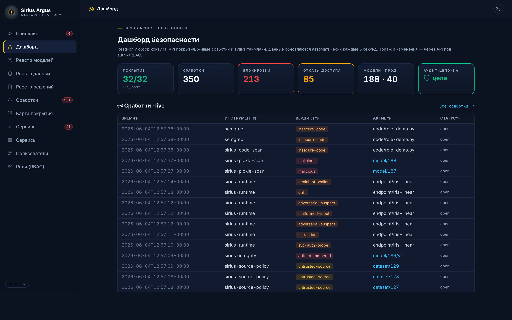
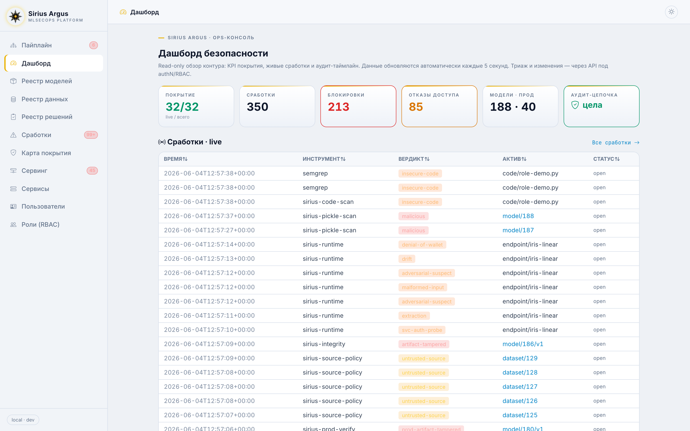

# Sirius Argus — Измеримая безопасность (KPI / SLO)

> «Что нельзя измерить — нельзя улучшить». Эти метрики питаются из реальных `Finding`/`GateExecution`/`AuditEvent` и выводятся на карту покрытия и CEO-дашборд. Закрывают пробел «нет измеримости».

## Метрики покрытия (защищённость как состояние)

| KPI | Определение | Целевой SLO |
|---|---|---|
| Coverage (поведения) | % BDD-сценариев со статусом *green* | ≥ 90% для P0/P1 |
| Coverage (угрозы) | % угроз с ≥1 активным контролем | 100% критических рисков |
| Critical-risk treatment | % критических рисков со статусом *mitigated* (не *open*) | 100% |
| Подписанные артефакты в проде | % прод-моделей с валидной подписью | 100% |
| Воспроизводимость | % прод-моделей с зафиксированными code+data+env | 100% |

## Метрики реакции (detect & respond)

| KPI | Определение | Целевой SLO |
|---|---|---|
| MTTD | медианное время от события до Finding | < 1 мин (автодетект) |
| MTTR (реакция) | от Finding до триажа (open → triaged) | < 1 ч для SEV1 |
| MTTR (ремедиация) | от Finding до закрытия | SEV1 < 24 ч, SEV2 < 7 дн |
| Gate block rate | доля промоушенов/ingest, остановленных гейтом | трекинг тренда |
| False-positive rate | доля Finding, закрытых как FP | трекинг; цель — снижать без потери TP |
| Аудит-полнота | % действий с записью в append-only аудит | 100% |

## Принципы

- KPI считаются **из данных платформы**, а не вручную — иначе это самообман.
- Тренды важнее снимка: рост findings по severity или MTTR — сигнал деградации.
- FP-rate и block-rate балансируют: «всё красное» так же бесполезно, как «всё зелёное» (риск SC-3 «выключили шумный сканер»).

> Эти KPI — верхний срез карты покрытия (architecture.md §9); CEO-дашборд показывает их агрегат.

CEO-дашборд вживую — покрытие, блокировки, отказы доступа, целостность аудита и поток сработок (слева — тёмная тема, справа — светлая):

<table><tr>
<td></td>
<td></td>
</tr></table>
